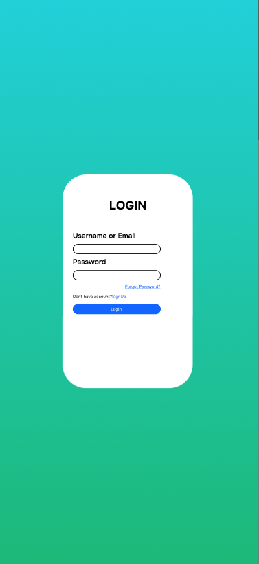
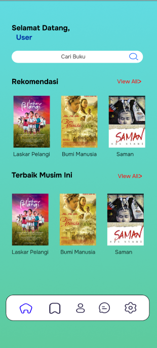
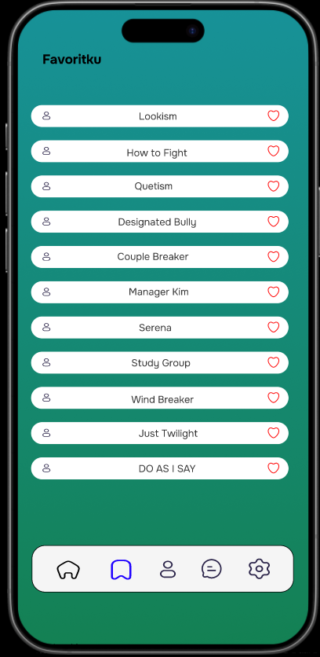
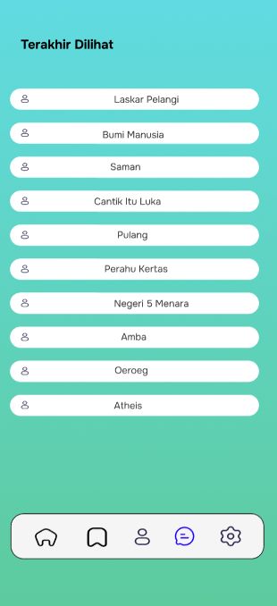
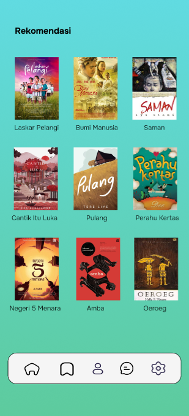
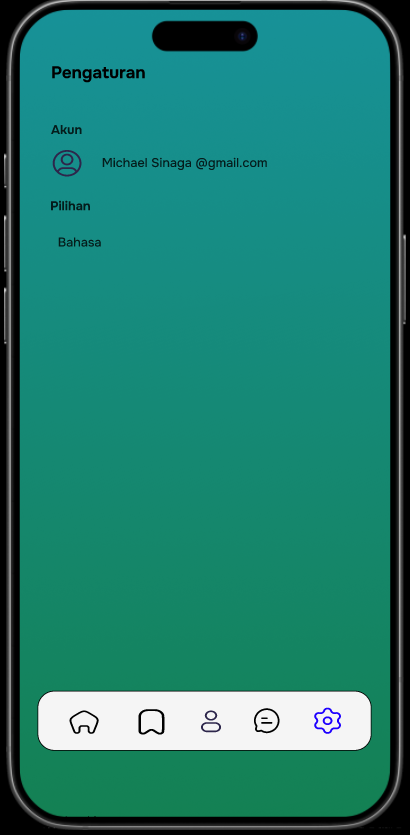
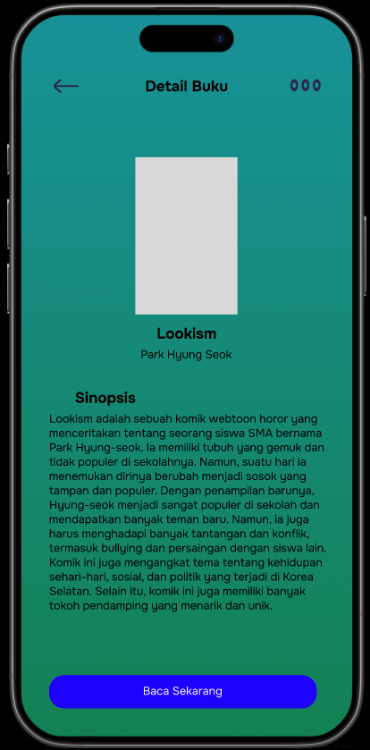
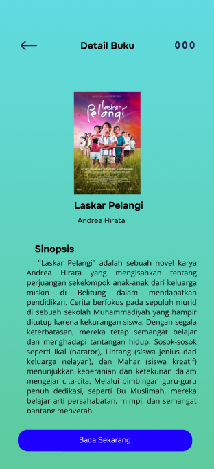
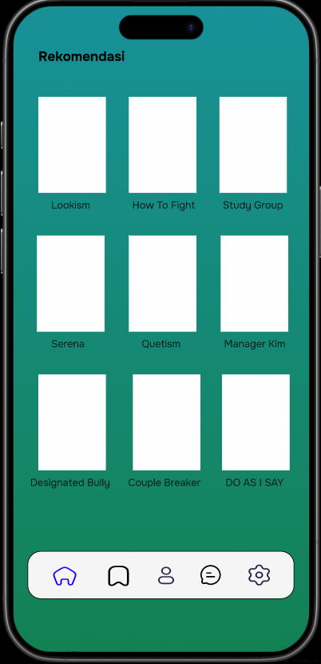

# Pemograman Mobile
## Nama  : Muhamad Ananda Putra Fraceda
## NIM   : 312310440
## Kelas : TI.23.A4

## Storyboard
# Splash Screen
 
# Dashboard (Homepage)
 
# Interface Button Favortiku
 
# Interface Button Terakhir dilihat
 
# Interface Button Login
 
# Interface Button Pengaturan
 
# Interface buku yg ingin dibaca
 
# Interface buku yang sedang dibaca
 

## Mockup
# Splash Screen
 
# Dashboard
 
# Interface Button Favoritku
 
# Interface Button Terakhir dilihat
 
# Interface Button Login
 
# Interface Button Pengaturan
 
# Interface buku yg ingin dibaca
 
# Interface buku yang sedang dibaca
 
# Interface jika menekan viewall
 
